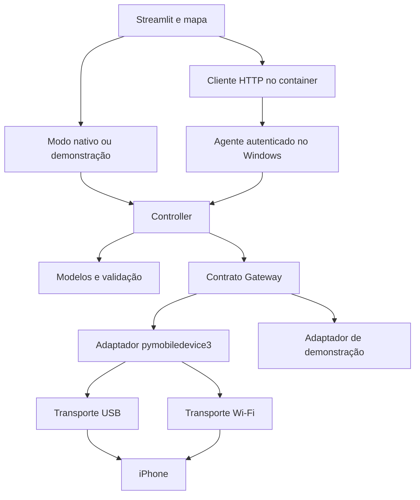

# Arquitetura da versão inicial

Aplicação local em camadas leves, dentro de um único projeto Python. Streamlit apresenta a UI; serviços coordenam operações; um adaptador encapsula pymobiledevice3.



## Responsabilidades

- UI: renderizar, receber eventos, exibir estado. Sem comandos de dispositivo em funções de desenho.
- Domínio: coordenadas, estados, operações e validação independente de bibliotecas externas.
- Serviço: autorizar operação conforme estado, bloquear concorrência, atribuir ID e timeout, atualizar resultado.
- Gateway: descobrir e verificar dispositivo, aplicar/encerrar simulação e fechar o worker; mapear erros técnicos. Controller fornece conexão, desconexão, bloqueio e deduplicação.
- AgentClient: traduz as operações da interface para o agente HTTP; o Controller do agente centraliza o estado entre clientes.
- Adaptador real: CLI pymobiledevice3 11.20.2 com worker persistente. O contrato foi implementado, mas compatibilidade com hardware permanece pendente.
- Adaptador de demonstração: descoberta e sucesso sem hardware. Os testes substituem esse adaptador para provocar falhas, timeout e concorrência.

## Streamlit e efeitos externos

O script é reexecutado por interações. Guardar estado de apresentação e eventos já consumidos em session_state. Recursos e bloqueio de dispositivo devem ser controlados por um gerenciador no processo, para evitar conflito entre abas/sessões. Não cachear funções que enviam ou encerram simulação.

Preservar ID do evento durante reruns. Alterar zoom/centro sem disparar envio. Falhas/timeout não provocam retry automático. As chamadas são síncronas nesta versão inicial, com spinner, timeout e bloqueio; worker persistente mantém o contexto iOS. A responsividade com hardware precisa ser medida.

## Estrutura implementada

```text
app.py
src/quickmapgo/
  core.py
  device.py
  device_worker.py
  agent.py
  remote.py
  ui/map/
tests/
  test_core.py
  test_agent.py
  test_device.py
  test_app.py
  map_events.test.cjs
.streamlit/config.toml
pyproject.toml
docs/
```

Sem banco ou nuvem. A ADR 0002 introduz agente HTTP autenticado no Windows para atender ao painel Docker. A configuração explicita endereço local e porta 8501. Bibliotecas de iOS podem usar serviços/túneis auxiliares; o painel deve distinguir essas necessidades do seu próprio servidor local.

## Ciclo de vida

Conectar não aplica coordenada. Desconectar não equivale a clear. Solicitar clear é ação separada com resultado verificável. Não depender do fechamento da aba para limpar simulação. Ao reiniciar a aplicação, verificar o estado e fornecer opção explícita de encerramento.

## Privacidade

Guardar pareamento apenas no mecanismo local suportado pela biblioteca. Não copiar segredos para repositório. Logs de diagnóstico devem mascarar identificadores e omitir coordenadas por padrão. Usar configuração local e sem publicação automática.
