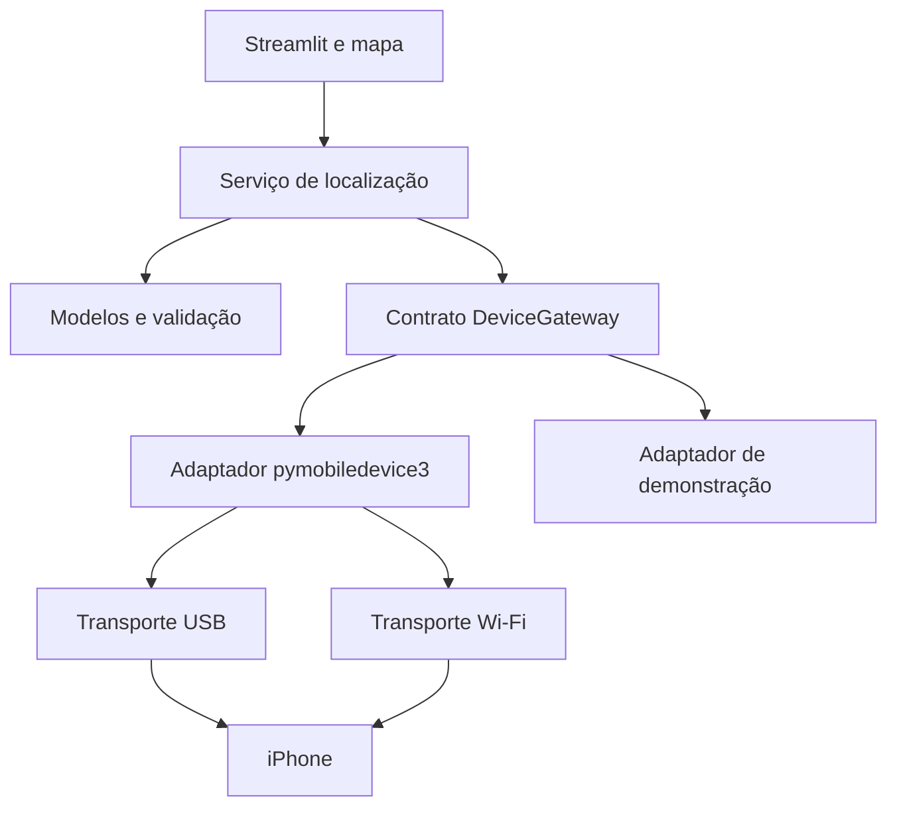

# Arquitetura proposta

Aplicação local em camadas leves, dentro de um único projeto Python. Streamlit apresenta a UI; serviços coordenam operações; um adaptador encapsula pymobiledevice3.



## Responsabilidades

- UI: renderizar, receber eventos, exibir estado. Sem comandos de dispositivo em funções de desenho.
- Domínio: coordenadas, estados, operações e validação independente de bibliotecas externas.
- Serviço: autorizar operação conforme estado, bloquear concorrência, atribuir ID e timeout, atualizar resultado.
- Gateway: descobrir, conectar, enviar, encerrar e desconectar; mapear erros técnicos.
- Adaptador real: escolher APIs/CLI documentadas e compatíveis após prova de viabilidade.
- Adaptador falso: reproduzir sucesso, falha, timeout e desconexão sem hardware.

## Streamlit e efeitos externos

O script é reexecutado por interações. Guardar estado de apresentação e eventos já consumidos em session_state. Recursos e bloqueio de dispositivo devem ser controlados por um gerenciador no processo, para evitar conflito entre abas/sessões. Não cachear funções que enviam ou encerram simulação.

Preservar ID do evento durante reruns. Alterar zoom/centro sem disparar envio. Falhas/timeout não provocam retry automático. Evitar chamadas longas dentro da renderização; escolher a estratégia de worker após medir o adaptador e validar atualização de estado na thread apropriada.

## Estrutura planejada (ainda não criada)

```text
app.py
src/quickmapgo/
  domain/
  services/
  adapters/
  ui/
tests/
  unit/
  integration/
  manual/
.streamlit/config.toml
pyproject.toml
docs/
```

Não criar banco, API HTTP adicional ou infraestrutura de nuvem neste estágio. A configuração futura explicitará endereço local e porta 8501. Bibliotecas de iOS podem usar serviços/túneis auxiliares; o painel deve distinguir essas necessidades do seu próprio servidor local.

## Ciclo de vida

Conectar não aplica coordenada. Desconectar não equivale a clear. Solicitar clear é ação separada com resultado verificável. Não depender do fechamento da aba para limpar simulação. Ao reiniciar a aplicação, verificar o estado e fornecer opção explícita de encerramento.

## Privacidade

Guardar pareamento apenas no mecanismo local suportado pela biblioteca. Não copiar segredos para repositório. Logs de diagnóstico devem mascarar identificadores e omitir coordenadas por padrão. Usar configuração local e sem publicação automática.
