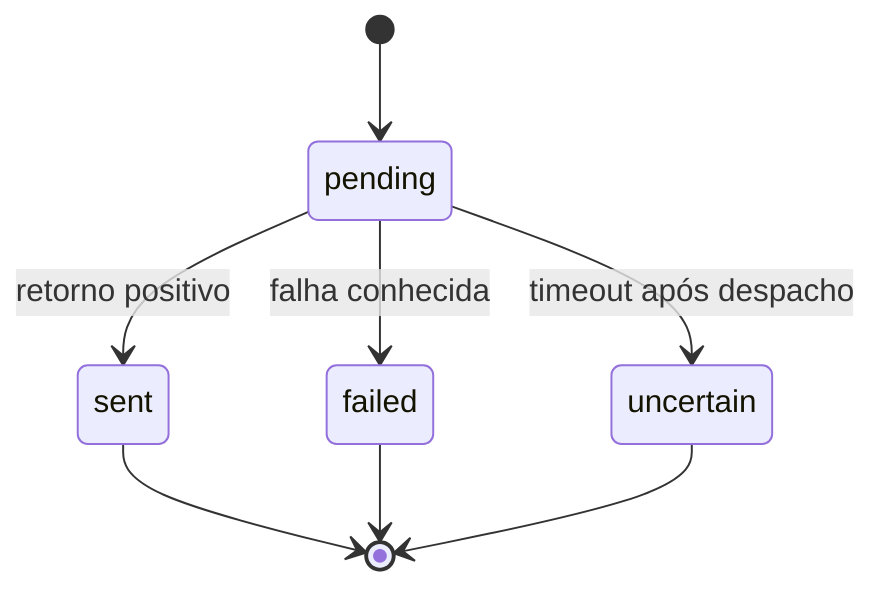

# Modelos e contratos

Modelos de domínio em memória, sem esquema de banco neste MVP. Esta é a especificação conceitual; a versão inicial usa Coordinate e Controller com snapshots em dicionários em core.py, sem criar classes para cada linha da tabela.

| Modelo | Campos | Invariantes |
| --- | --- | --- |
| Coordinate | latitude: float, longitude: float | Finitos; faixas RF11 |
| DeviceInfo | id: str, name: str, ios_version: str, available_transports: conjunto | ID único interno; mascarado na UI/logs |
| Connection | device_id, transport, state, last_error | Apenas um aparelho ativo; transport = usb ou wifi |
| LocationInstruction | id, event_id, device_id, coordinate, requested_at, completed_at, status, error_code | ID único; estado terminal não é alterado por rerun |
| SimulationSession | last_attempt, last_success, simulation_state | Nunca substituir last_success por tentativa falha |
| OperationResult | status, message, error_code | Nenhum campo promete aceitação pelo consumidor |

Datas de operações devem ser timezone-aware, armazenadas em UTC e exibidas no horário local com indicação do fuso. Usar biblioteca padrão quando suficiente; Coordinate é dataclass; demais estruturas são dicionários nesta versão.

## Estados

Conexão: disconnected, connecting, ready, error.

Instrução: pending, sent, failed, uncertain.

Simulação: unknown, possibly_active, clear_acknowledged. Mesmo sent indica apenas retorno positivo do serviço. Após encerramento ou desconexão abrupta, verificar o comportamento real.

## Contrato DeviceGateway (conceitual)

| Operação | Entrada | Saída |
| --- | --- | --- |
| discover | transport | lista de DeviceInfo |
| connect | device_id, transport | Connection pronta ou erro normalizado |
| set_location | connection, coordinate, operation_id | OperationResult |
| clear_location | connection, operation_id | OperationResult |
| disconnect | connection | resultado de encerramento da conexão |

Contrato não assume uma assinatura da biblioteca. O adaptador traduz para a versão fixada de pymobiledevice3, ainda sem validação física. Não implementar REST endpoints apenas para representar essas operações.

## Erros normalizados

device_not_found, device_not_trusted, driver_missing, developer_mode_required, tunnel_failed, transport_unavailable, unsupported_environment, invalid_coordinate, operation_busy, timeout, device_disconnected, internal_error.

Não classificar automaticamente todo erro como incompatibilidade; preservar diagnóstico técnico local sem expor registros privados.

## Concorrência e idempotência

Um bloqueio por aparelho cobre set e clear. Manter registro de event_id já consumido antes do efeito externo. Uma repetição do mesmo evento retorna o resultado conhecido. Um novo clique pode ter coordenadas iguais e deve receber outro event_id. Se o componente não oferecer essa distinção, resolver na UI antes de integrar hardware.
